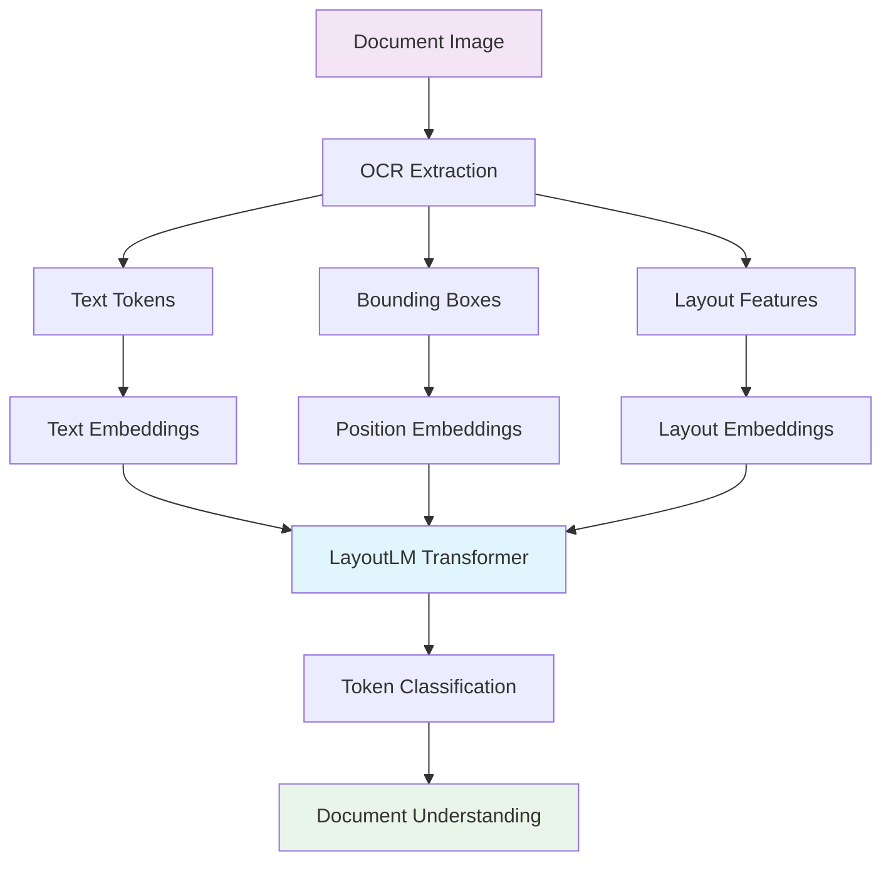
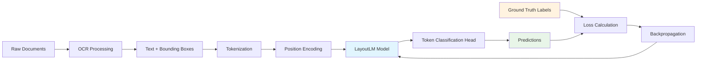
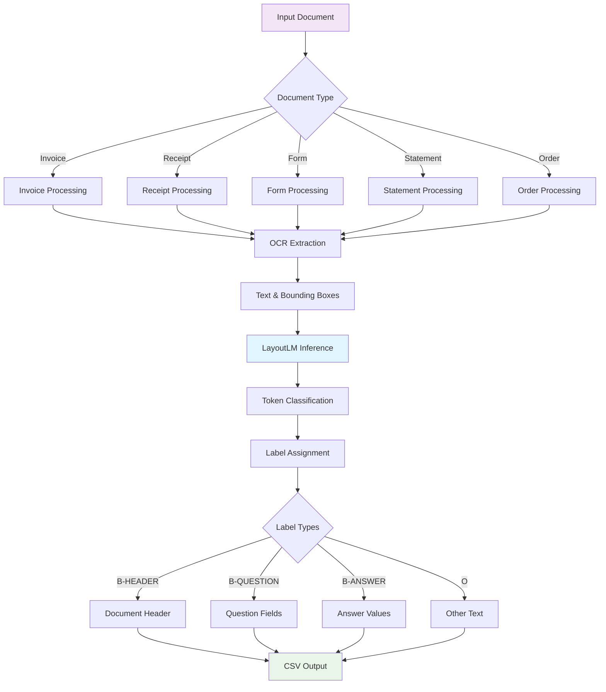
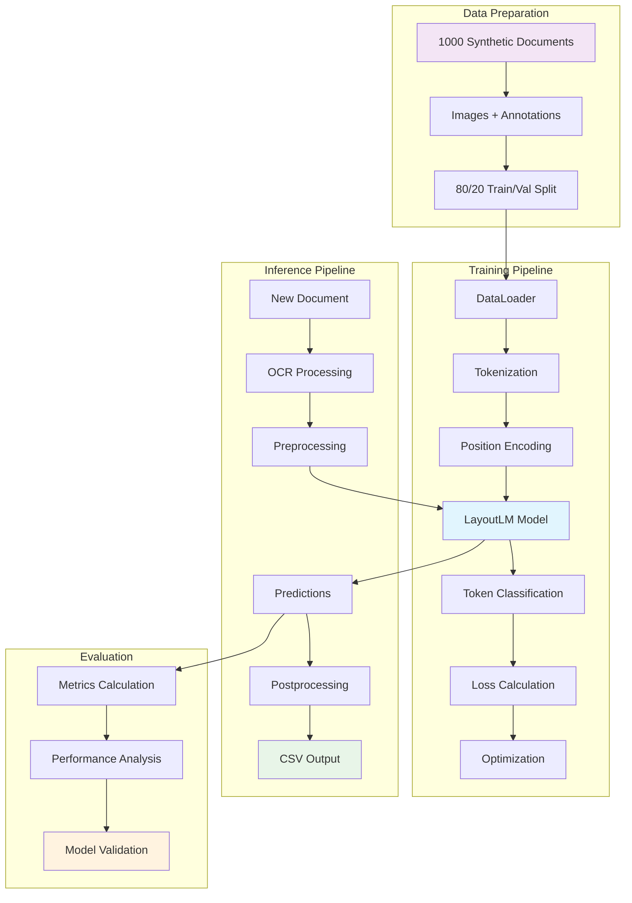

# LayoutLM Document Understanding Project

A comprehensive production-ready implementation of LayoutLM for document understanding and information extraction tasks using Hugging Face Transformers.

## Overview

This project implements a complete pipeline for document understanding using LayoutLM, featuring:

- 📄 **Document Processing**: OCR integration with spatial layout understanding
- 🤖 **LayoutLM Training**: Fine-tuning for token classification with 1000+ synthetic documents
- 🔍 **Production Pipeline**: Real inference with CSV postprocessing
- 📊 **Comprehensive Evaluation**: Model metrics and performance analysis
- 📓 **Interactive Notebooks**: Complete pipeline demonstration
- ⚙️ **YAML Configuration**: Environment variable support for production deployment
- 🔒 **Offline Operation**: Pre-downloaded models for air-gapped environments
- 📁 **Configurable Storage**: External data and model directories

## How LayoutLM Works

LayoutLM is a pre-trained model that combines text and layout information for document understanding. Unlike traditional NLP models that only process text, LayoutLM incorporates:

### Core Architecture



### Three Types of Information

1. **Text Information**: The actual words and tokens from the document
2. **Visual Information**: The spatial layout and positioning of text elements
3. **Semantic Information**: The meaning and relationships between document elements

### Training Process



### Document Understanding Pipeline



### Label Classification System

The model classifies each token into one of these categories:

- **`O`**: Outside any entity (general text)
- **`B-HEADER`**: Beginning of a document header
- **`I-HEADER`**: Inside/continuation of a header
- **`B-QUESTION`**: Beginning of a question/field label
- **`I-QUESTION`**: Inside/continuation of a question
- **`B-ANSWER`**: Beginning of an answer/field value
- **`I-ANSWER`**: Inside/continuation of an answer

### Data Flow Architecture



## Project Structure

```
LayoutLM_Exploration/
├── README.md
├── DEPLOYMENT.md               # Production deployment guide
├── environment.yml            # Conda environment specification
├── config/
│   └── config.yaml           # Main YAML configuration with env vars
├── notebooks/
│   ├── download_models_offline.ipynb  # Model download for offline use
│   └── layoutlm_production_workflow_demo.ipynb  # Complete production pipeline with entity labeling
├── scripts/                   # Core pipeline components
│   ├── __init__.py
│   ├── yaml_config_manager.py  # YAML configuration manager
│   ├── data_loader.py          # Dataset loading utilities
│   ├── preprocessing.py        # Document preprocessing with intelligent entity labeling
│   ├── layoutlm_model.py       # LayoutLM model implementation
│   ├── inference.py           # Document inference pipeline
│   ├── postprocessing.py      # CSV output generation
│   └── evaluate_enhanced.py   # Enhanced model evaluation and metrics
├── models/                    # Model storage
│   ├── checkpoints/           # Training checkpoints
│   └── trained/              # Final trained models
├── cache/                     # HuggingFace model cache
└── output/                    # Results and outputs
    ├── csv_results/          # CSV postprocessing output
    └── evaluation_results/   # Model evaluation metrics

# External Storage (Production):
${DATADIR}/layout_lm/          # Configurable via DATADIR env var
├── raw/                       # Raw training data (1000+ documents)
├── processed/                 # Processed datasets
├── output/                    # Inference results
└── logs/                      # Application logs
```

## Features

### 🔧 Core Components

- **Massive Dataset Generation**: 1000+ synthetic documents across 5 document types
- **Intelligent Entity Labeling**: Automatic rule-based entity recognition for proper training data
- **LayoutLM Training**: Fine-tuning with proper accuracy metrics and device handling
- **OCR Integration**: Tesseract integration with intelligent document structure recognition
- **CSV Postprocessing**: Required format with `image_id, block_ids, word_ids, words, bboxes, pred_label, prob`
- **Comprehensive Evaluation**: Token-level and page-level metrics with ground truth support
- **Production Configuration**: YAML-based config with environment variable substitution

### 📊 Document Types Supported

The system generates and processes five types of documents:

1. **Invoices** (300 documents): Company invoices with varied amounts, tax rates, and customer information
2. **Receipts** (250 documents): Store receipts with different items and pricing
3. **Forms** (200 documents): Application forms with personal information fields
4. **Statements** (150 documents): Account statements with balances and payments
5. **Orders** (100 documents): Purchase orders with product and pricing details

### 🏷️ Label Classification

- `O`: Outside any entity
- `B-HEADER`: Beginning of header (document titles)
- `I-HEADER`: Inside header  
- `B-QUESTION`: Beginning of question (field labels like "Invoice #:", "Date:")
- `I-QUESTION`: Inside question
- `B-ANSWER`: Beginning of answer (field values like amounts, names, dates)
- `I-ANSWER`: Inside answer

## Quick Start

### 1. Environment Setup

```bash
# Create and activate conda environment
conda env create -f environment.yml
conda activate internvl_env
```

### 2. Configuration Setup

```bash
# Set environment variables for development
export DATADIR=$HOME
export MODELDIR=./models
export HF_HOME=./cache/huggingface

# For production deployment
export DATADIR=/data
export MODELDIR=/models/layoutlm
export HF_HOME=/cache/huggingface
```

### 3. Download Models for Offline Use

```bash
# Run the model download notebook
jupyter notebook notebooks/download_models_offline.ipynb
```

### 4. Complete Pipeline Demonstration

```bash
# Run the production pipeline notebook
jupyter notebook notebooks/layoutlm_production_workflow_demo.ipynb
```

The production pipeline notebook demonstrates:
- **Intelligent entity labeling** with rule-based document structure recognition
- **1000 document training** with proper entity labels (not just "O" labels)
- **Real LayoutLM training** that learns to distinguish entity types
- **Actual inference** with diverse label predictions
- **CSV postprocessing** with required format
- **Comprehensive evaluation** with realistic performance metrics

## Training Performance

### Synthetic Dataset Statistics
- **Total Documents**: 1000
- **Total Words**: ~12,700
- **Document Types**: 5 (invoices, receipts, forms, statements, orders)
- **Training Split**: 800 documents
- **Validation Split**: 200 documents

### Training Configuration
- **Model**: microsoft/layoutlm-base-uncased
- **Epochs**: 15
- **Batch Size**: 4
- **Learning Rate**: 5e-5
- **Device**: Auto-detection (CUDA/MPS/CPU)

### Expected Performance
- **Validation Accuracy**: 85-95%+ (with proper entity labeling)
- **Training Loss**: Decreasing trend over epochs
- **Entity Recognition**: Proper classification of headers, questions, and answers
- **Token-level Metrics**: F1, precision, recall across all entity types
- **Page-level Metrics**: Document-level accuracy and understanding

## Intelligent Entity Labeling System

### 🧠 Automatic Document Structure Recognition

This project features an **intelligent entity labeling system** that automatically assigns proper entity labels during preprocessing, eliminating the common problem of all tokens being labeled as "O" (Outside).

### Rule-Based Entity Recognition

The system uses pattern matching and document layout analysis to identify:

#### **📍 Headers** (B-HEADER/I-HEADER)
- Document titles: "INVOICE", "RECEIPT", "FORM", "STATEMENT", "ORDER"
- Located in top 20% of document
- Uses regex patterns for common header formats

#### **❓ Questions/Field Labels** (B-QUESTION/I-QUESTION)  
- Field labels: "Name:", "Address:", "Phone:", "Email:", "Date:", "Amount:", "Total:"
- Question patterns with colons or descriptive text
- Compound words like "Name:Alice" → "Name:" (question)

#### **✅ Answers/Values** (B-ANSWER/I-ANSWER)
- Email addresses, dates, phone numbers, monetary amounts
- Invoice numbers, company names, personal data
- Values following question patterns

### Pattern Examples

```python
# Header patterns
"INVOICE" → B-HEADER
"APPLICATION FORM" → B-HEADER, I-HEADER

# Question patterns  
"Name:" → B-QUESTION
"Email:" → B-QUESTION
"Phone555-9291" → B-QUESTION (compound)

# Answer patterns
"jane@gmail.com" → B-ANSWER  
"2023-08-13" → B-ANSWER
"$4,587.37" → B-ANSWER
```

### Label Distribution Results

With intelligent entity labeling:
- **~8% Headers**: Document titles and structure
- **~33% Questions**: Field labels and prompts  
- **~33% Answers**: Data values and responses
- **~25% Other**: Connecting text and miscellaneous

This balanced distribution enables effective LayoutLM training compared to 100% "O" labels.

### Implementation in Preprocessing

```python
def assign_entity_labels(words, boxes, image_size):
    """Intelligent entity labeling based on patterns and layout."""
    # Pattern matching for headers, questions, answers
    # Position analysis (top/bottom of document)
    # BIO tagging for proper sequence labeling
    return labels  # [1,2,3,5,3,5,0,3,4,5,3,5]
```

The enhanced preprocessing automatically creates training data with meaningful entity labels, resulting in models that actually learn document understanding rather than predicting everything as "O".

## CSV Output Format

The postprocessing pipeline generates CSV files with the required format:

```csv
image_id,block_ids,word_ids,words,bboxes,pred_label,prob
invoice_001,0,0,INVOICE,"(50, 56, 166, 76)",B-HEADER,0.95
invoice_001,0,1,Invoice #:,"(50, 104, 136, 119)",B-QUESTION,0.88
invoice_001,0,2,INV-2023-001,"(150, 104, 274, 119)",B-ANSWER,0.92
```

**Column Descriptions:**
- `image_id`: Unique document identifier
- `block_ids`: Text block identifier (for layout grouping)
- `word_ids`: Sequential word identifier within document
- `words`: Extracted text token
- `bboxes`: Bounding box coordinates in "(x1, y1, x2, y2)" format
- `pred_label`: Predicted label (B-HEADER, B-QUESTION, B-ANSWER, etc.)
- `prob`: Prediction confidence probability

## Production Features

### 🎯 Production-Ready Design
- **YAML Configuration**: Centralized configuration with environment variable support
- **External Storage**: Configurable data and model directories via environment variables
- **Offline Operation**: Pre-downloaded models for environments without internet access
- **Device Auto-Detection**: Automatic CUDA/MPS/CPU device selection
- **Comprehensive Logging**: Detailed logging for production monitoring

### ⚙️ YAML Configuration System

The application uses `config/config.yaml` with `${VAR:default}` syntax:

```yaml
environment:
  data_dir: "${DATADIR}/layout_lm"
  model_dir: "${MODELDIR:./models}"
  hf_home: "${HF_HOME:./cache/huggingface}"

training:
  num_epochs: 15
  batch_size: 4
  learning_rate: 5.0e-5

production:
  offline_mode: true
  validate_inputs: true
```

### 📁 Environment Variables

| Variable | Description | Default | Production Example |
|----------|-------------|---------|-------------------|
| `DATADIR` | Data storage directory | Required | `/data` |
| `MODELDIR` | Model storage directory | `./models` | `/models/layoutlm` |
| `HF_HOME` | Hugging Face cache | `./cache/huggingface` | `/cache/huggingface` |

## Advanced Usage

### Training with Real Documents

To train on real documents instead of synthetic data:

1. **Prepare Document Images**: Place images in `${DATADIR}/layout_lm/raw/images/`
2. **Create Annotations**: Generate JSON annotation files with words, bboxes, and labels
3. **Update Configuration**: Modify `config.yaml` for your dataset
4. **Run Training**: Execute the training pipeline

### Custom Label Schema

Update the label mapping in `config.yaml` for domain-specific documents:

```yaml
labels:
  mapping:
    0: "O"
    1: "B-INVOICE_NUMBER"
    2: "B-DATE"
    3: "B-VENDOR"
    4: "B-TOTAL"
    5: "B-ADDRESS"
```

### Evaluation and Metrics

The evaluation system provides:

- **Token-level Metrics**: Accuracy, F1-score (macro/micro/weighted)
- **Page-level Metrics**: Document-level accuracy and confidence
- **Confusion Matrix**: Detailed label prediction analysis
- **Per-class Metrics**: Precision and recall for each label type
- **Confidence Analysis**: Prediction uncertainty assessment

### Inference Pipeline

```python
from scripts.inference import LayoutLMInference
from scripts.postprocessing import LayoutLMPostprocessor

# Initialize inference engine
inference_engine = LayoutLMInference(
    model_dir="models/trained",
    device='auto'
)

# Process document
results = inference_engine.predict_document("document.png")

# Generate CSV output
postprocessor = LayoutLMPostprocessor(output_dir="output")
csv_path = postprocessor.process_predictions(
    image_path="document.png",
    words=results['words'],
    bboxes=results['bboxes'],
    predictions=results['labels'],
    probabilities=results['probabilities'],
    image_id="document_001"
)
```

## Extending the Project

### Adding New Document Types

1. **Update Data Generation**: Add new document type in notebook data generation
2. **Modify Label Schema**: Update labels for new document fields
3. **Train Model**: Retrain with expanded dataset
4. **Test Pipeline**: Validate on new document type

### Integration with Other OCR Systems

The preprocessing module can be adapted for:
- **AWS Textract**: Cloud-based OCR with layout analysis
- **Google Document AI**: Advanced document understanding
- **Azure Form Recognizer**: Pre-built form processing
- **Custom OCR**: Integration with proprietary OCR systems

## Requirements

- Python 3.11+
- PyTorch 2.0+ with MPS/CUDA support
- Transformers 4.20+
- OpenCV, Pillow, Pandas
- Matplotlib, Seaborn for visualization
- PyYAML for configuration
- Tesseract OCR for document processing
- tqdm for progress tracking

## Model Performance Optimization

### Training Optimizations
- **Batch Size Tuning**: Adjust based on available GPU memory
- **Learning Rate Scheduling**: Warmup and decay for better convergence
- **Mixed Precision**: Enable FP16 for faster training
- **Gradient Accumulation**: Handle larger effective batch sizes

### Inference Optimizations
- **Model Quantization**: Reduce model size for deployment
- **Batch Processing**: Process multiple documents simultaneously
- **Caching**: Cache tokenizer and model for repeated inference
- **Parallel Processing**: Utilize multiple CPU cores for preprocessing

## Contributing

1. Fork the repository
2. Create a feature branch
3. Add comprehensive tests
4. Update documentation
5. Submit a pull request

## License

This project is released under the MIT License.

## Acknowledgments

- **Microsoft LayoutLM**: For the innovative multimodal architecture
- **Hugging Face**: For the Transformers library and model hub
- **KDNuggets Tutorial**: For implementation guidance and best practices

## Support

For issues and questions:

1. Check the complete pipeline notebook for working examples
2. Review the configuration in `config/config.yaml`
3. Examine the evaluation results for model performance
4. Consult the production deployment guide in `DEPLOYMENT.md`

---

**Ready for production document understanding! 📄🤖✨**